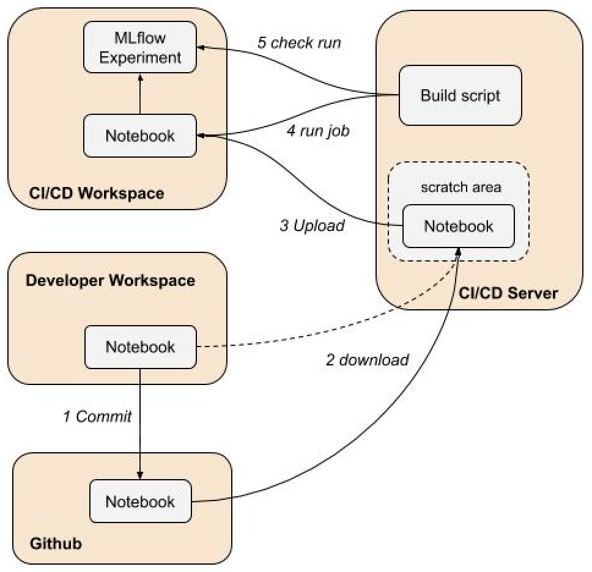

# mlflow-examples - Lightweight CI/CD for MLflow Notebook

## Overview

Train a notebook model with the Databricks API [runs submit](https://docs.databricks.com/dev-tools/api/latest/jobs.html#runs-submit) endpoint using the [notebook task](https://docs.databricks.com/dev-tools/api/latest/jobs.html#jobsnotebooktask).

The objective is to showcase the basic steps needed to run a CI/CD build with Databricks. 
Using an actual CI/CD tool is out of scope, so we demonstrate the basic primitive steps that would be incorporated into a CI/CD workflow.

For background see [Continuous integration and delivery on Databricks using Jenkins](https://docs.databricks.com/dev-tools/ci-cd.html).

## Workflow 



### Steps
1. Developer commits notebook changes to git
2. CI/CD build downloads notebook from git
3. Uploads notebook to a CI/CD workspace
4. Runs notebook with `run submit` endpoint of Databricks API
5. Checks job and MLflow run results

## Details

### 1. Commit notebook changes to git

Data scientists work in their workspace and commit the notebook to github.

### 2. Download notebook from git

The build script downloads the notebook to a scratch area in the build space.
Normally you download notebook from the git repo, but for development purposes you can download it directly from your workspace.

### 3. Upload notebook to Databricks workspace

The build script uploads the notebooks to a CI/CD workspace.
Note this is a logical workspace - it can either be a separate isolated CI/CD workspace or you can use just one workspace.

### 4. Run notebooks in scratch folder as a run submit with Databricks API

The build script initiates a Databricks [run submit](xx) job using a notebook task
with the [new_cluster.json](new_cluster.json) cluster spec file.
The job executes the notebook training run and logs the run details into an MLflow experiment and a DBFS output file.
The build script waits until the job is done by polling the job run ID.

### 5. Check job run results

The build script obtains the run ID from the job output file on DBFS which contains the MLflow run ID.
It then fetches the MLflow run using the MLflow API and checks for correct results.

## Run the build script

### Driver options

See [cicd_driver.py](cicd_driver.py) and [base_cicd_driver.py](base_cicd_driver.py).

|Name | Required | Default | Description|
|---|---|---|---|
| profile | no | none | ~/.databrickscfg profile |
| src_dir | yes | none | https://raw.github URI or Databricks workspace folder |
| src_files | yes | none | Source notebooks - comma delimited |
| dst_dir | yes | none | Destination Databricks workspace folder for build |
| cluster_spec | yes | none | Cluster JSON spec file |
| scratch_dir | yes | out | Local scratch folder for downloadeded notebooks |

### Cluster Spec

**Notebook Task Parameters**

|Name | Description|
|---|---|
| Experiment Name | MLflow experiment name |
| Run Name | Run name for MLflow run  |
| Scratch Dir | Scratch folder where input data and output logs are store |
| Max  Dir | Maximum depth for DecisionTreeRegressor model |

**Cluster spec file**
```
{
  "name": "MLflow CICD Notebook New Cluster",
  "new_cluster": {
    "spark_version": "6.4.x-cpu-ml-scala2.11",
    "node_type_id": "i3.xlarge",
    "num_workers": 1
  },
  "notebook_task": {
    "notebook_path": "/Users/john.doe@acme.com/tmp/cicd/Sklearn_Train_Predict",
    "base_parameters": {
       "Experiment Name": "/Users/john.doe@acme.com/tmp/Sklearn_Train_Predict",
       "Run Name": "MLflow CICD Notebook New Cluster",
       "Scratch Dir": "dbfs:/john.doe@acme.com/tmp/mlflow_cicd/notebook"
    }
  },
  "timeout_seconds": 3600
}
```


### Run

#### Run by downloading notebook from github
```
python -u cicd_driver.py \
  --src_dir https://raw.githubusercontent.com/amesar/mlflow-examples/master/databricks/cicd/notebook_cicd/notebooks \
  --src_files Sklearn_Train_Predict.py \
  --dst_dir /Users/john.doe@databricks.com/tmp/cicd \
  --cluster_spec new_cluster.json \
  --scratch_dir out \
  --report_file report.json
```

#### Run by downloading notebook directly from workspace
```
python -u cicd_driver.py \
  --src_dir /Users/john.doe@databricks.com/mlflow/mlflow_galleries/cicd \
  --src_files Sklearn_Train_Predict.py \
  --dst_dir /Users/john.doe@databricks.com/tmp/cicd \
  --cluster_spec new_cluster.json \
  --scratch_dir out \
  --report_file report.json
```

#### Output
```
Arguments:
  profile: None
  --src_dir https://raw.githubusercontent.com/amesar/mlflow-examples/master/databricks/cicd/notebook_cicd/notebooks \
  src_files: Sklearn_Train_Predict.py
  dst_dir: /Users/john.doe@acme.com/tmp/mlflow_cicd
  scratch_dir: out
  cluster_spec_file: new_cluster.json
  report_file: report.json
Host: https://acme.cloud.databricks.com
**** Downloading notebooks
https://raw.githubusercontent.com/amesar/mlflow-examples/master/databricks/cicd/notebook_cicd/notebooks/Sklearn_Train_Predict.py to out
**** Importing notebooks into Databricks
Importing into /Users/john.doe@acme.com/tmp/mlflow_cicd/Sklearn_Train_Predict
**** Running MLflow training job
Run 2398567
0: Run 2398567 waiting PENDING
1: Run 2398567 waiting RUNNING
2: Run 2398567 waiting TERMINATED
Waited 6.9 seconds
**** Checking job run
state: {'life_cycle_state': 'TERMINATED', 'result_state': 'SUCCESS', 'state_message': ''}
**** Checking MLflow run
Tracking URI: databricks
Output file: dbfs:/john.doe@acme.com/tmp/mlflow_cicd/notebook_run/mlflow_cicd.log
Run info:
  Experiment ID: 6276803
  Experiment Name: /Users/john.doe@acme.com/tmp/mlflow_cicd/Sklearn_Train_Predict_exp
  Run ID: 432d2ca7e9bc4042b022dffcbca7d49e
  Run params: {'max_depth': '8'}
  Run metrics: {'rmse': 0.7444946754042513}
  Run URI: https://acme.cloud.databricks.com/#mlflow/experiments/6276803/runs/432d2ca7e9bc4042b022dffcbca7d49e
  Browser: open -a "Google Chrome" "https://acme.cloud.databricks.com/#mlflow/experiments/6276803/runs/432d2ca7e9bc4042b022dffcbca7d49e"
```

## Report

A JSON report of the run is also created - see [report.json](samples/report.json).

```
{
  "info": {
    "start_time": "2020-04-06_02:31:50",
    "result_state": "SUCCESS",
    "end_time": "2020-04-06_02:32:06"
  },
  "arguments": {
    "profile": null,
    "src_dir": "https://raw.githubusercontent.com/amesar/mlflow-examples/master/databricks/cicd/notebook_cicd/notebooks",
    "src_files": "Sklearn_Train_Predict.py",
    "dst_dir": "/Users/john.doe@acme.com/tmp/mlflow_cicd",
    "scratch_dir": "out",
    "cluster_spec_file": "new_cluster.json",
    "report_file": "report.json"
  },
  "cluster_spec_file": "new_cluster.json",
  "cluster_spec": {
    "existing_cluster_id": "0303-131908-ills262",
    "notebook_task": {
      "notebook_path": "/Users/john.doe@acme.com/tmp/mlflow_cicd/Sklearn_Train_Predict",
      "base_parameters": {
        "Experiment Name": "/Users/john.doe@acme.com/tmp/mlflow_cicd/Sklearn_Train_Predict_exp",
        "Run Name": "Laptop MLflow CICD Notebook Existing Cluster",
        "Scratch Dir": "dbfs:/john.doe@acme.com/tmp/mlflow_cicd/notebook_run",
        "Max Depth": 8
      }
    },
    "timeout_seconds": 3600,
    "run_name": "MLflow CICD Notebook Existing Cluster"
  },
  "downloaded_files": [
    "https://raw.githubusercontent.com/amesar/mlflow-examples/master/databricks/cicd/notebook_cicd/notebooks/Sklearn_Train_Predict.py"
  ],
  "uploaded_files": [
    "/Users/john.doe@acme.com/tmp/mlflow_cicd/Sklearn_Train_Predict"
  ],
  "databricks_job": {
    "job_id": 33535,
    "run_id": 2398567,
    "number_in_job": 1,
. . .
```
