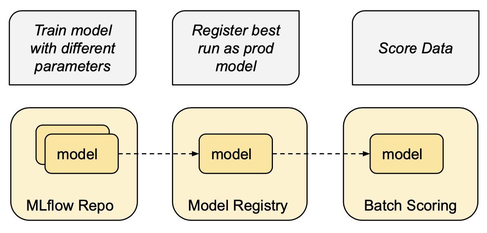
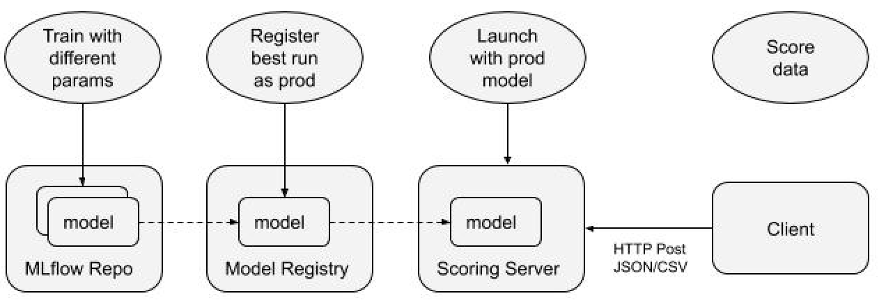

# mlflow-examples - e2e-ml-pipeline

End-to-end ML pipeline: training, model registry, deployment and prediction with MLflow scoring server.

Basis of subsequent CI/CD pipeline.

## Overview
* [train.py](train.py) - Run several sklearn training runs with different hyperparameters.
* [register_model.py](register_model.py) - Find the best run and register it as model version `models:/e2e-ml-pipeline/production`.
* [batch_score.py](batch_score.py) - Batch score with sklearn and pyfunc flavors.
* [deploy_server.py](deploy_server.py) - Launch a scoring server and submit scoring payload to `http://localhost:5001/invocations` endpoint. The scoring server can be either local web server or local SageMaker container.
* [test.py](test.py) - Test above steps - train, register, batch score and deploy.

## Architecture Diagrams

### Batch Scoring 


### Real-time Scoring 



## Setup

See [conda.yaml](conda.yaml).
```
conda env create --file conda.yaml
conda activate mlflow-examples-e2e-ml-pipeline
```

## Run

Key default values - see [common.py](common.py).

|Name | Value |
|---|---|
| Experiment name | e2e-ml-pipeline
| Model name | e2e-ml-pipeline
| Model URI | models:/e2e-ml-pipeline/production
| Port | 5001
| Docker image name | sm-e2e-ml-pipeline

### Train

Program: [train.py](train.py).

Run several sklearn training runs with different hyperparameters.

#### Options
|Name | Required | Default | Description|
|---|---|---|---|
| experiment_name | no | e2e-ml-pipeline | Name of experiment
| data_path | no | ../../data/wine-quality-white.csv | Data file

#### Run
```
python train.py 
```

```
Arguments:
  experiment_name: e2e-ml-pipeline
  data_path: ../../data/wine-quality-white.csv
Experiment ID: 5
Params: (1, 2, 4, 16)
0.820  1 ae9b699cfc5e42f9bca2bd83f95f9524 5
0.785  2 5ae2374d1b524a4e8051c4fa1d7dbcc8 5
0.759  4 4c3da779aa8d48ff97f0c0ed9cafe47c 5
0.867 16 319b94e45b63483cbc8225d0d3a8d6bc 5
Best run: 0.759 4c3da779aa8d48ff97f0c0ed9cafe47c
```

### Register Model

Program: [register_model.py](register_model.py).

Find the best run and register it as model version `models:/e2e-ml-pipeline/production`.

#### Options
|Name | Required | Default | Description|
|---|---|---|---|
| experiment_name | no | e2e-ml-pipeline | Name of experiment
| data_path | no | ../../data/wine-quality-white.csv | Data file
| model_name | no | e2e-ml-pipeline | Registered model

#### Run
```
python register_model.py 
```
```
Arguments:
  experiment_name: e2e-ml-pipeline
  data_path: ../../data/wine-quality-white.csv
  model_name: e2e-ml-pipeline
Best run: 4c3da779aa8d48ff97f0c0ed9cafe47c 0.7592585886611769
Found model e2e-ml-pipeline
Found 0 versions for model e2e-ml-pipeline
Reg Model: <class 'mlflow.entities.model_registry.registered_model.RegisteredModel'> {'_name': 'e2e-ml-pipeline', '_creation_time': 1584292037095, '_last_updated_timestamp': 1584302072077, '_description': '', '_latest_version': [<ModelVersion: creation_timestamp=1584302072077, current_stage='None', description='', last_updated_timestamp=1584302072077, name='e2e-ml-pipeline', run_id='4c3da779aa8d48ff97f0c0ed9cafe47c', source='file:///Users/ander/work/mlflow/server/local_mlrun/mlruns/5/4c3da779aa8d48ff97f0c0ed9cafe47c/artifacts/sklearn-model', status='READY', status_message='', user_id='', version='35'>]}
Version: id=36 status=READY state=None
Waited 0.01 seconds
Version: id=36 status=READY state=None
Version: id=36 status=READY state=Production
predictions: [6.24342105 6.24342105 6.68112798 ... 6.68112798 5.94352941 5.35624284]
```

### Batch Score 

Program: [batch_score.py](batch_score.py).

Score the best model with sklearn and pyfunc flavors.


#### Options
|Name | Required | Default | Description|
|---|---|---|---|
| model_uri | no | models:/e2e-ml-pipeline/production | Registered model URI
| data_path | no | ../../data/wine-quality-white.csv | Data file

#### Run

```
python batch_score.py
```
```
sklearn score
predictions: [6.24931129 6.74246575 6.74246575 ... 6.24931129 6.74246575 6.24931129]

pyfunc score
predictions: [6.24931129 6.74246575 6.74246575 ... 6.24931129 6.74246575 6.24931129]
```

### Deploy Scoring Server

Program: [deploy_server.py](deploy_server.py).

Steps:
* Fetches the best model from the model registry.
* Launches a scoring server with this model
  * By default it launches a local web server - see [mlflow models serve](https://mlflow.org/docs/latest/cli.html#mlflow-models-serve). 
  * Optionally can launch a local SageMaker container - see [mlflow.sagemaker](https://mlflow.org/docs/latest/python_api/mlflow.sagemaker.html#mlflow-sagemaker).
* Submits scoring payload to `http://localhost:5001/invocations` endpoint.


#### Options

|Name | Required | Default | Description|
|---|---|---|---|
| port | no | 5001 | Port
| docker_image | no | none | Docker image name
| model_uri | no | models:/e2e-ml-pipeline/production | Registered model URI
| launch_container | no | false | Default is to launch local server, if true launch local SageMaker container
| data_path | no | ../../data/wine-quality-white.csv | Data file

#### Run local webserver

Executes the following mlflow command:
  * `mlflow models serve --port 5001 --model-uri models:/e2e-ml-pipeline/production`

```
python -u deploy_server.py 
```
```
Arguments:
  port: 5001
  docker_image: sm-e2e-ml-pipeline
  model_uri: models:/e2e-ml-pipeline/production
  launch_container: False
  data_path: ../../data/wine-quality-white.csv

Command: mlflow models serve --port 5001 --model-uri models:/e2e-ml-pipeline/production
Process ID: 27572
Calling scoring server: 4/10000
. . . 
Calling scoring server: 8/10000
Ran pip subprocess with arguments:
['/Users/andre/miniconda/envs/mlflow-9373994feef365bde89b7072d1498bdbc226ba90/bin/python', '-m', 'pip', 'install', '-U', '-r', '/Users/ander/work/mlflow/server/local_mlrun/mlruns/2/868ce3ccb7c448fe9939c5b21c29ff0a/artifacts/sklearn-model/condaenv.kdzq1ifu.requirements.txt']
Processing /Users/ander/Library/Caches/pip/wheels/6d/72/87/348958818bec20c3a64243396065e34600ada290199f96abfa/mlflow-1.7.0-py3-none-any.whl
Collecting cloudpickle==1.2.2
  Using cached cloudpickle-1.2.2-py2.py3-none-any.whl (25 kB)
. . . 
2020/03/15 22:44:36 INFO mlflow.models.cli: Selected backend for flavor 'python_function'
Done waiting for 4.36 seconds
Done waiting - OK - successful deploy - predictions: [5.335031847133758, 5.050955414012739, 5.726950354609929]
Done waiting - killing process 27572
```


#### Run local SagemMaker container

Executes the following mlflow commands:
  * `mlflow sagemaker build-and-push-container --build --no-push --container sm-e2e-ml-pipeline`
  * `mlflow sagemaker run-local -m models:/e2e-ml-pipeline/production -p 5001 --image sm-e2e-ml-pipeline`

```
python -u deploy_server.py --launch_container
```
```
Arguments:
  port: 5001
  docker_image: sm-e2e-ml-pipeline
  model_uri: models:/e2e-ml-pipeline/production
  launch_container: False
  data_path: ../../data/wine-quality-white.csv
Starting command: mlflow sagemaker build-and-push-container --build --no-push --container sm-e2e-ml-pipeline
. . .
Successfully built a03004c4fa63
Successfully tagged sm-e2e-ml-pipeline:latest
Done waiting for command: mlflow sagemaker build-and-push-container --build --no-push --container sm-e2e-ml-pipeline
Starting command: mlflow sagemaker run-local -m models:/e2e-ml-pipeline/production -p 5001 --image sm-e2e-ml-pipeline
2020/03/15 22:48:34 INFO mlflow.models.docker_utils: Building docker image with name sm-e2e-ml-pipeline
/var/folders/_9/tbkxzw0116v2cp_zq4f1_1cm0000gp/T/tmp0q3cm6g9/
/var/folders/_9/tbkxzw0116v2cp_zq4f1_1cm0000gp/T/tmp0q3cm6g9//Dockerfile
Sending build context to Docker daemon  3.072kB
Process ID: 27632
Calling scoring server: 0/10000
. . .
Calling scoring server: 23/10000
. . .
Done waiting for 65.36 seconds
Done waiting - OK - Successful deploy - predictions: [5.335031847133758, 5.050955414012739, 5.726950354609929]
Done waiting - killing process 27632
```

## Tests

Program: [test.py](test.py).

Test above steps in sequential order - train, register, batch score and deploy.

By default launches a local server. If you wish to launch the docker container: `export LAUNCH_CONTAINER=true`.

```
py.test -v test.py
```

```
test.py::test_train PASSED 
test.py::test_register_model PASSED 
test.py::test_batch_score PASSED 
test.py::test_deploy_server PASSED 
============================== 4 passed in 6.17s ===============================
```
